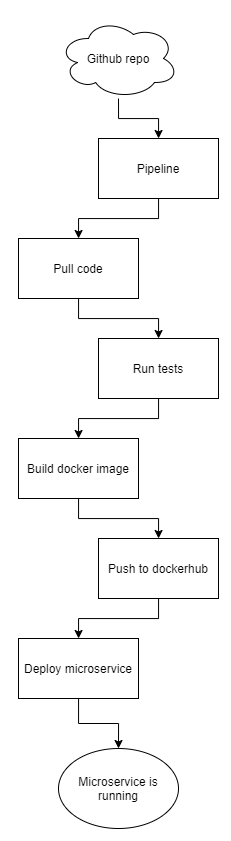

# Bitdam DevOps Interview Assignment

This is an assignment for devop position.

### Project goal:  
Creating a CI pipeline for a Python product.

### Solution architecture:  
Development language: Python.  
3RD parties: git, Github, Jenkins, Docker, Minikube, Helm
Distribution type: Public.  

### Project guidelines:  
1. Jenkins will be used as a CI engine and will run and schedule the pipeline. 
2. Git will be used as source control management tool. 
3. The Jenkins pipeline must be written inside a Jenkinsfile and committed into a remote  any git repository. 

### what do you need? 
1. Computer.
2. Github account.
3. DockerHub account.

## Project Steps

### step 1: Install jenkins locally with helm
1. Install docker on the computer.
2. Install minikube.
3. Install helm.
4. Install jenkins with helm chart on local minikube.

### step 2: Connect jenkins to github and dockerhub
1. Install docker plugin in configure jenkins to connect to your dockerhub account.
2. Configure jenkins to connect github account.
3. Create a job to execute the Jenkinsfile.

### step 3: Create dockerfile
1. Create dockerfile with all dependencies for the microservice.
2. Install python virtualenv.
3. Install requirements.txt.
3. Add microservice directory.
3. Execute microservice/main.py.
4. Build the image and test if the microservice is running.

### step 4: Create deployment
1. Create new deployment on minikube and run microservice.
2. Execute microservice/main.py.
3. Make sure the deployment is running.

### step 5: Write declarative pipeline
1. Pull SCM.
2. Run python unittests in the microservice folder using py.test.
3. Build image docker image using Dockerfile.
4. Push docker image to dockerhub.
5. Deploy image using deployment.yaml.

